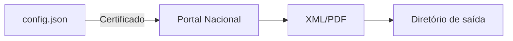

# Baixar NFS-e Portal Nacional

  

Ferramenta em **Python** para automatizar o download de Notas Fiscais de Serviço (NFS-e) diretamente do Portal Nacional, salvando XML e PDF com praticidade.

  

[](https://github.com/USERNAME/baixar_nfse_portal_nacional/actions/workflows/build_exe.yml)

[](LICENSE)

  

## Baixe o executável

  

Sempre que mudanças são enviadas para o branch `main` o projeto gera

automaticamente um arquivo `exe` através do GitHub Actions. Você pode

obter a versão mais recente acessando a página de releases e baixando o

executável disponível.

  

[Download do instalador](https://github.com/USERNAME/baixar_nfse_portal_nacional/releases/latest)

  

## Visão geral

  

O projeto simplifica a obtenção de notas fiscais eletrônicas emitidas pelo Portal Nacional da NFS-e. Ideal para empresas e contadores que precisam manter o arquivo de notas organizado sem acessar manualmente o site.

  

### Principais recursos

  

- Baixa automaticamente XML e PDFs das notas.

- Armazena logs e permite retomar o processo pelo último NSU.

- Utiliza certificado digital (PFX ou PEM) para autenticação.

- Possui interface gráfica simples construída com `tkinter`.

- Suporte a criação de executável standalone via PyInstaller.

  

### Fluxo de funcionamento

  



  

## Instalação

  

1. Tenha o **Python 3.10** ou superior instalado.

2. (Opcional) Crie um ambiente virtual:

  

```bash

python3 -m venv .venv

source .venv/bin/activate  # Windows: .venv\Scripts\activate

```

  

3. Instale as dependências executando o 1.instalador.py (se criou o .exe execute dentro da dist criada, pois cria e realoca alguns arquivos necessários)

  

## Configuração

  

Edite o arquivo `config.json` ou no menu `Configurações`, possui as chaves:

  

- `file_prefix`: prefixo dos arquivos.

- `download_pdf`: `true` para baixar também o PDF.

- `delay_seconds`: intervalo entre consultas.

- `timeout`: tempo limite das requisições.

  

## Cadastros

No menu `Cadastros` clique em `Adicionar`. Todos os registros são gravados internamente em `cadastros.json`, uma nova pasta para a empresa é criada com os arquivos e diretórios bases em `/packs` com o nome sendo o `Código` da empresa. Sendo os seguintes campos:

  

- `Código`: identificador numérico, registro único

- `Empresa`: nome de identificação da empresa

- `CNPJ`: CNPJ da empresa, registro único

- `Senha do Certificado`: senha do certificado

- `Certificado (.pfx)` : importa uma cópia do certificado escolhido

- `Vencimento Cert:` se a senha estiver correta, valida a data de vencimento do certificado para controle

  

#### NSU

O NSU é o Número Sequencial Único, cada empresa, seja prestadora ou emissora, possui contagem própria que inicia em 1 e segue aumentando em 1 a cada nota (emitida ou tomada, mesma contagem).

Cada empresa possui controle de NSU individualmente na tela de cadastro. Usário consegue alterar os valores sobreescrevendo ou excluindo os registros. O controle por competência é feita com base desses regsitros salvos em `nsu_competencia.json` dentro da pasta da empresa

  

## Uso

Execute o script principal e vá para o menu `Baixar NFSe`:

  

```bash

python download_nfse.py

```

  

O programa inicia a interface gráfica e começa a baixar as notas de acordo com a competência escolhiada. Os arquivos são gravados seguindo o padrão `<prefixo>_AAAA-MM_<chave>.xml`. Os `.xml` são separados por tipo (Prestador, Tomador ou Evento) e importados para o `relatorio_[cod].xlsm` para gerar relatório e ao final é gerado um arquivo `.zip` para exportação.

  

## Contribuição

  

Contribuições são bem-vindas! Abra issues ou pull requests com melhorias, correções ou novas funcionalidades. Para mudanças maiores, discuta previamente através de uma issue.

  

## Licença

  

Distribuído sob a licença [MIT](LICENSE).

  

## Contato

  

Para dúvidas ou suporte abra uma issue no GitHub ou contate **Renan R. Santos** através do [LinkedIn](https://www.linkedin.com/).

  

## Documentação online

  

Você pode publicar a pasta `docs/` via **GitHub Pages** para hospedar uma documentação completa em <https://USERNAME.github.io/baixar_nfse_portal_nacional/>.

  

## Dados estruturados

  

```html

<script type="application/ld+json">

{

  "@context": "https://schema.org",

  "@type": "SoftwareApplication",

  "name": "Baixar NFS-e Portal Nacional",

  "applicationCategory": "BusinessApplication",

  "operatingSystem": "Windows, Linux, macOS",

  "license": "https://opensource.org/licenses/MIT",

  "offers": {

    "@type": "Offer",

    "price": "0",

    "priceCurrency": "BRL"

  }

}

</script>

```

  

---

  

### Tópicos sugeridos

`nfse`, `nfs-e`, `portal-nacional`, `download`, `python`, `automacao`, `xml`, `pdf`.

  
  
  

### APIs NACIONAIS

https://www.gov.br/nfse/pt-br/biblioteca/documentacao-tecnica/tabelas-de-dominio